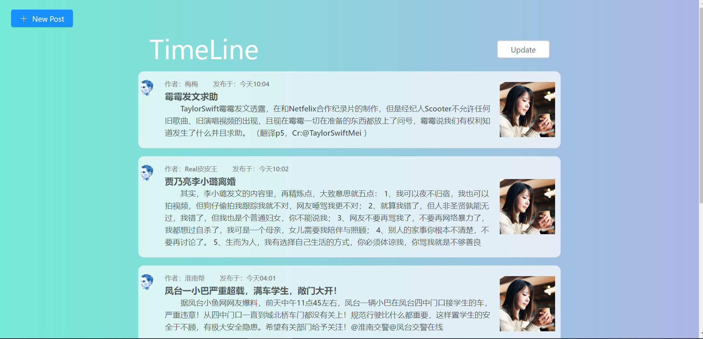
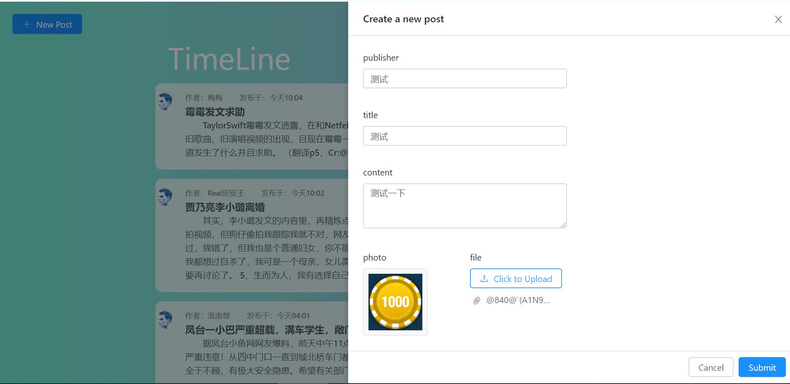
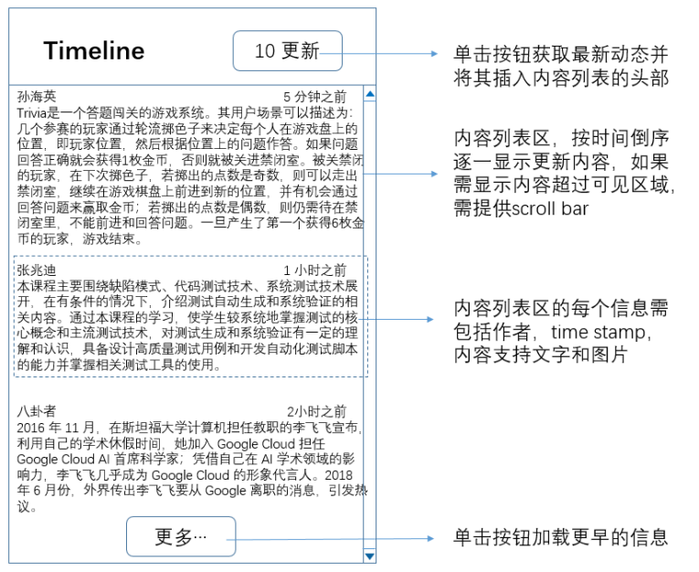

[前端代码](https://github.com/TimGin117/timeline-front)

# 效果截图

# 需求

# 拓展功能

除了内容支持文字和图片之外，还增加了上传附件的功能

# 小组成员及分工

彭锋：文件上传功能实现、联调

钟天景：前端

莫锦波：测试

兰于权：后端

# 环境参数

后端框架：SpringBoot 2.1.4 Release

前端框架：React.js

数据库：Mysql 8.0.15

持久层框架：Spring Data JPA

测试：JUnit

服务器：Centos7  Nginx反向代理

